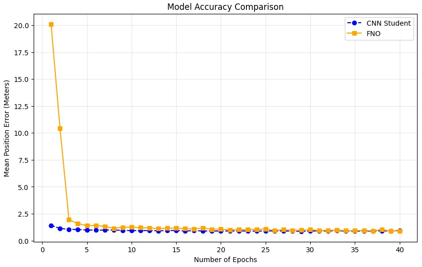
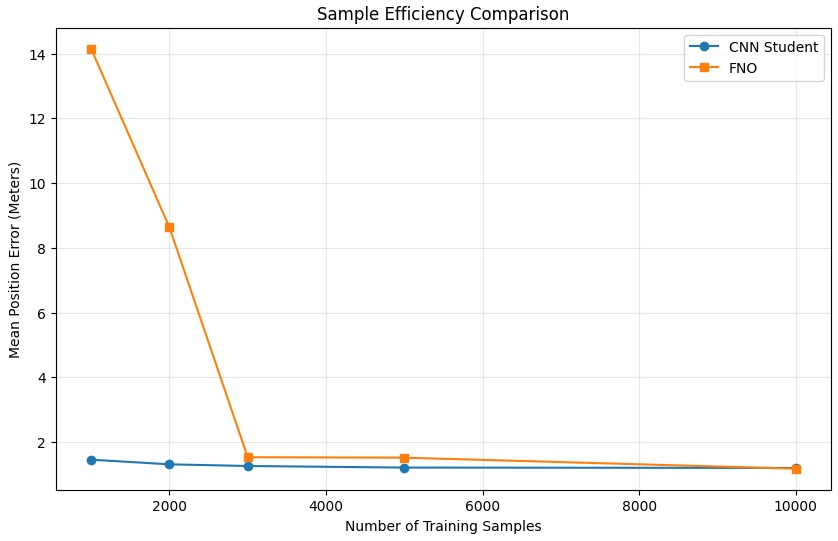

# Inverse Wave Source Localization from Sparse Sensors: A Comparative Study of FNO and CNN

[](https://opensource.org/licenses/MIT)
[](https://www.python.org/)
[](https://pytorch.org/)

A deep learning research project investigating the efficiency of **Convolutional Neural Networks (CNN)** versus **Fourier Neural Operators (FNO)** in reconstructing 2D wave heatmaps from sparse 1D sensor data, utilizing **Knowledge Distillation**.

Yotam Cohen - yotam.cohen@campus.technion.ac.il  
Idan Nissany - idan.nissany@campus.technion.ac.il

---

## Overview

The precise localization of wave sources from sparse sensor measurements is a fundamental inverse problem. While the "forward" problem of simulating wave propagation is well-posed and governed by known partial differential equations (PDEs), the "inverse" problem - determining the source location from a few scattered sensors- is often ill-posed and computationally expensive. Traditional numerical methods rely on iterative optimization techniques that suffer from high latency. We aim to replace these expensive solvers with a data-driven Deep Learning approach capable of mapping sparse time-series data directly to a spatial source distribution with significantly reduced inference latency.

In this study, we present a rigorous comparative analysis of two distinct architectures:
1.  **CNN Student:** A standard Convolutional Network with `ConvTranspose2d` decoding, trained using knowledge distillation.
2.  **FNO (Learned Basis) Student:** An MLP-based architecture that learns an optimal basis transformation (evolving beyond standard FFT).

We generated a synthetic dataset, trained each architecture independently, and conducted a series of comparative experiments to evaluate their final accuracy.

### Final Architectures
A visual comparison of the **CNN** (left) and **FNO** (right) architectures:
<p align="center">
  
   
</p>

### Experimental Evaluation
To rigorously compare the architectures, we conducted four distinct stress tests focusing on real-world reliability and computational efficiency.

* **Convergence Speed:** We tracked the validation loss over training epochs to determine which model learns the wave physics faster.
* **Data Efficiency:** We retrained both models on increasingly smaller subsets of data (from 100% down to 10%) to test generalization capabilities in data-scarce environments.
* **Sensor Resilience:** We simulated hardware failure by "killing" one sensor (in probability p=0.5, outputting zeros or gaussian noise with std=0.1) during inference to see if the models could reconstruct the source using only partial data.
* **Noise Robustness:** We injected varying levels of Gaussian noise ($\sigma \in [0, 0.1]$) to evaluate performance stability in high-interference environments.

The quantitative results of these experiments are visualized below:

<table align="center">
  <tr>
    <td align="center" width="50%">
      
      <br />
      <b>(a) Convergence Speed</b>
    </td>
    <td align="center" width="50%">
      
      <br />
      <b>(b) Data Efficiency</b>
    </td>
  </tr>
</table>

<table align="center">
  <tr>
    <td align="center" width="50%">
      
      <br />
      <b>(c) Sensor Resilience</b>
    </td>
    <td align="center" width="50%">
      
      <br />
      <b>(d) Noise Robustness</b>
    </td>
  </tr>
</table>

### Key Findings
* **Superior Generalization:** The **FNO** converges significantly faster and maintains high accuracy even with 80% less training data compared to the CNN (see plots *a* and *b*).
* **Safety Critical Resilience:** In the event of a sensor failure, the **FNO** successfully reconstructs the wave source using global physical dependencies, whereas the CNN's error spikes (see plot *c*).
* **The Trade-off:** While the FNO dominates in clean and low-noise environments, the **CNN** exhibits slightly better stability when the signal-to-noise ratio is extremely low (high noise), as shown in plot *d*.

---
### Project Structure
```text
.
├── Assets/                                  # Images and plots used in README                         
│   ├── accuracy(epochs).jpg
│   ├── accuracy(noise).jpg
│   ├── accuracy(sample_num).jpg
│   ├── cnn_architecture.png
│   ├── fno_architecture.png
│   └── sensor_mal.jpg             
├── Experimentation/
│   ├── CNN_experimentations.ipynb            # Experiments refining the CNN model
│   └── FNO_experimentations.ipynb            # Experiments refining the FNO model
├── Models/
│   ├── CNN_Student.py                        # CNN student model class definition
│   ├── CNN_Teacher.py                        # CNN teacher model class definition
│   └── FNO.py                                # FNO model class definition
├── Utilities/
│   ├── data_utilities.py                     # Functions for data generation & augmentation
│   └── testing.py                            # Evaluation functions for final comparisons
├── CNN_vs_FNO_comparisons.ipynb              # Main comparison results (The "Final Report")
├── CNN_vs_FNO_comparisons_same_size.ipynb    # Comparison results (Same size models)
├── environment.yml                           # Conda environment configuration
├── requirements.txt                          # Pip package dependencies
└── README.md                                 # Project documentation
```

##  Installation
You can set up the environment using either **Python venv** (standard) or **Conda** (recommended for data science).

### Option A: Using `venv` (Standard Python)
1. **Create the environment:**
   ```bash
   python -m venv .venv
   ```

2. **Activate the environment:**
   
   * **Windows (PowerShell):**
   ```bash
   .\.venv\Scripts\Activate.ps1
   ```

   * **Mac / Linux / Git Bash:**
   ```bash
   source .venv/bin/activate
   ```
   
3. **Install dependencies:**
   ```bash
   pip install -r requirements.txt
   ```

### Option B: Using `conda`
1. **Create the environment from the file:**
   ```bash
   conda env create -f environment.yml
   ```
2. **Activate the environment:**
   ```bash
   conda activate cnn-vs-fno
   ```

### Running the Notebooks
When you open a `.ipynb` file (e.g., in VS Code or Jupyter Lab), you must select the correct kernel to run the code:

* If you used Option A, select `.venv` (or "Python 3.12.x ('.venv': venv)").

* If you used Option B, select `cnn-vs-fno.`   
